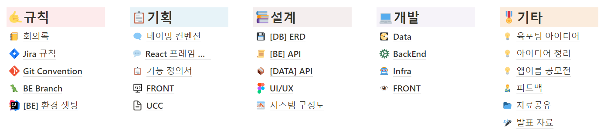
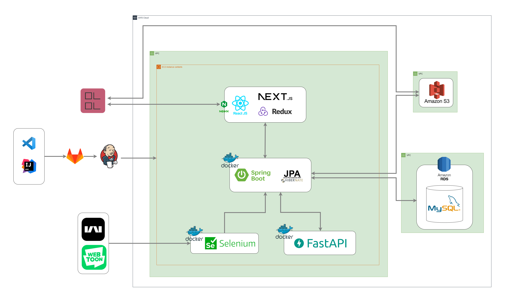
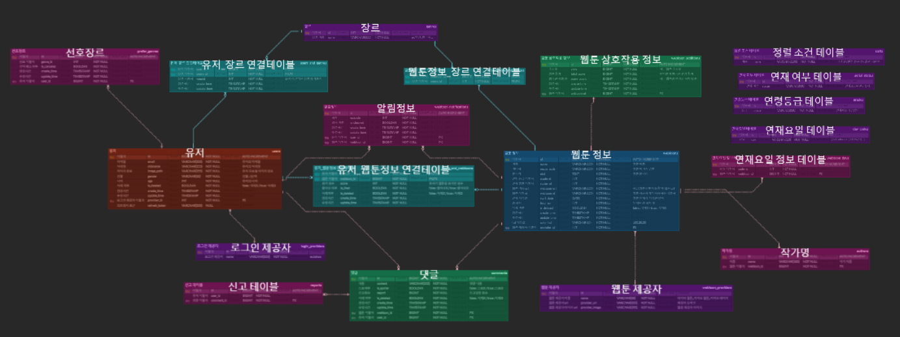

# ManaMana
<div align="center">


</div>

##  📱**프로젝트 소개**📱
---

### ***웹툰 추천 플랫폼***
마나마나는 여러 플랫폼으로 나눠져서 서비스 되고 있는 웹툰을 하나의 플랫폼에서 추천 받고, 관리할 수 있게 해서 사용자들이 편리하게 웹툰 서비스를 즐길 수 있도록 기획한 서비스입니다.


## ✨**주요기능**✨
---
- **사용자 맞춤 웹툰 추천**
- **웹툰 상세 정보 제공**
- **웹툰별 댓글 작성 기능**
- **해당 웹툰페이지로 이동 기능**
- **관심 등록 웹툰 알림기능**
- **웹툰 취향 월드컵**


## 👨‍👨‍👧‍👦**팀원소개**👨‍👨‍👧‍👦
---
<table>
    <tr>
        <td height="140px" align="center"> <a href="https://github.com/oth54477">
             <br><br> 👑 김태훈 <br>(Back-End) </a> <br></td>
        <td height="140px" align="center"> <a href="https://github.com/lsh9672">
             <br><br> 😎 이상현 <br>(Back-End) </a> <br></td>
        <td height="140px" align="center"> <a href="https://github.com/yeonnno">
             <br><br> 😆 양연호 <br>(Back-End) </a> <br></td>
        <td height="140px" align="center"> <a href="https://github.com/zouamare">
             <br><br> 😁 김주하 <br>(Front-End) </a> <br></td>
        <td height="140px" align="center"> <a href="https://github.com/baamkyu">
             <br><br> 🙄 임범규 <br>(Front-End) </a> <br></td>
        <td height="140px" align="center"> <a href="https://github.com/happyd918">
             <br><br> 😶 김태학 <br>(Front-End) </a> <br></td>
    </tr>
    <tr>
        <td align="center">REST API<br/>Data<br/>Crawling</td>
        <td align="center">REST API<br/>CI/CD<br/>Infra<br/></td>
        <td align="center">REST API<br/>Crawling<br/>S3<br/></td>
        <td align="center">UI/UX<br/>React<br/></td>
        <td align="center">UI/UX<br/>React<br/></td>
        <td align="center">UI/UX<br/>React<br/></td>
    </tr>
</table>

## ✨**개발환경**✨

### 협업 툴
   

### **Infra**
     

### **FrontEnd**
    

### **BackEnd**
    

### **Data**
   

## ✨**프로젝트 진행**✨

### **프로젝트 기간**
```
- 총 기간 : 2023.02.27 ~ 2023.04.07 (6주)
- 기획 : 2023.02.27 ~ 2023.03.12 (2주)
- 프로젝트 설계 : 2023.03.13 ~ 2023.03.19(1주)
- 구현 : 2023.03.20 ~ 2023.04.02(2주)
- 테스트 및 버그수정, 산출물 정리 : 2023.04.03 ~ 2023.04.07(1주)
```

### **GIT**
- **컨벤션**
 
 |태그|설명|예시|
|---|---|---|
|Feat|새로운 기능 추가|Feat : 유저 조회 기능|
|Fix|파일, 코드, 버그 수정/삭제|Fix : 삭제 댓글 조회되는 현상 수정|
|Docs|문서 작성 및 수정|Docs : README.md 수정|
|Refactor|프로덕션 코드 리팩토링|Refactor : 예외처리 로직 리펙토링|

- **브랜치**
```
  └─main
    ├─be_develop
    ├─bigdata_develop
    │  └─recommand_develop
    ├─crawling_develop
    │  ├─data_processing
    │  ├─kakao_page_crawling
    │  ├─kakao_webtoon_crawling
    │  └─naver_webtoon_crawling
    └─fe_develop
```

### **Notion**



## ✨**산출물**✨


### **링크**
|기능 정의서|와이어 프레임|[BE]api 명세서|[data]api 명세서|
|----------|-------------|---------|-------------------|
|[바로가기](https://delicate-utensil-152.notion.site/bb10f86ae6e648b78c53aaf3bb39468a)|[바로가기](https://www.figma.com/file/PGY5MYKUi58Tdci77wshl8/%EC%9B%B9%ED%88%B0-%EC%B6%94%EC%B2%9C?node-id=218-7813&t=Js6R40No6jePK6ox-0)|[바로가기](https://delicate-utensil-152.notion.site/BE-API-8af815cbdfe3437f84094df6701f9a31)|[바로가기](https://delicate-utensil-152.notion.site/DATA-API-1999356d2d6846f5a550ed762a136cb9)|


### **시스템 아키텍처**


### **ERD**



